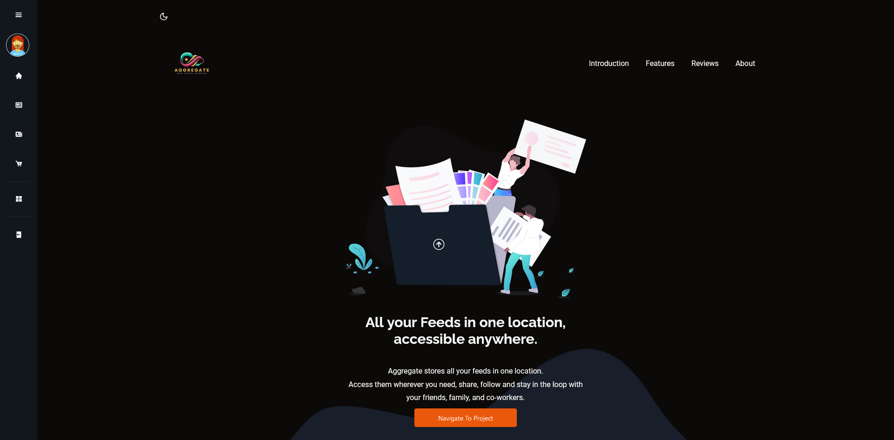

<p align="center">
  <a href="" rel="noopener">
 </a>
</p>

<h3 align="center">aggregate-fronteend</h3>

<div align="center">

[]()
[](https://github.com/Blue-Davinci/Aggregate-FronteEnd/issues)
[](https://github.com/Blue-Davinci/Aggregate-FronteEnd/pulls)
[](/LICENSE)

</div>

---

<p align="center"> <b>Aggregate</b>
Unify, Simplify, Aggregate!
    <br> 
</p>



## 📝 Table of Contents

- [About](#about)
- [Getting Started](#getting_started)
- [Deployment](#deployment)
- [Usage](#usage)
- [Built Using](#built_using)
- [TODO](../TODO.md)
- [Contributing](../CONTRIBUTING.md)
- [Authors](#authors)
- [Acknowledgments](#acknowledgement)

## 🧐 About <a name = "about"></a>

The Aggregate front-end is a fully integrated and user friendly svelte application design to seamlessly integrate with the sister project: [The Aggregate Backend](https://github.com/Blue-Davinci/Aggregate)

Aggregate brings together your favorite news sources, blogs, and updates into a single, easy-to-navigate platform. Our goal is to make sure you never miss out on important updates while providing you with a personalized experience. Whether it's tech news, sports updates, or the latest gadgets, Aggregate ensures you stay informed effortlessly.

<hr />


## 🏁 Getting Started <a name = "getting_started"></a>

These instructions will get you a copy of the project up and running on your local machine for development and testing purposes. See [deployment](#deployment) for notes on how to deploy the project on a live system.

💡🔔**Heads Up**
The app uses `page.server.js` to communicate with the `aggregate` backend with the exception of `formless` requests such as the `feed follows` and `favorites` system which use the `API` methods using `server.js` in the `/api` route.

### Prerequisites
Prior to running the <b>Aggregate</b> project, you need to make sure that you have the following installed in your system: 
- **Node.js:** This project is built with Svelte, which requires Node.js to run. You can download Node.js from the official website.

- **Visual Studio Code:** This is the recommended code editor for this project. You can download it from the official website.

- **Svelte:** This project is built with Svelte. You can install it globally on your system by running npm install -g svelte.

- **Golang and The Aggregate Back-end:** This can be found [here](https://github.com/Blue-Davinci/Aggregate)

### Installing

You can hit the ground running by:

1. **Cloning the Repo:** Clone this repo by doing
```bash
git clone https://github.com/Blue-Davinci/Aggregate-Frontend.git
```

2. **Navigate to the Project Directory:** Done with downloading the repo? Go ahead and navigate to the directory by doing: 
Say what the step will be

```bash
cd aggregate-frontend
```
3. **Install Node.Js:** Haven't installed `node.js`? What are you waiting for, go ahead and download it from their [official website](https://nodejs.org/)

4. **Install Svelte:** Now get your nose deep by downloading svelte like below: 
```bash
npm create svelte@latest 
```

5. **Install the project's dependancies:** Proceed and install the project's dependancies by running:
```bash
npm install
```

6. **Launch the Aggregate Backend:** Start and launch the backend server by following the instructions [here](https://github.com/Blue-Davinci/aggregate?tab=readme-ov-file#installing)

7. Make sure you have the following 2 files in the root folder i.e `Aggregate-Frontend\` as they hold all the links used to interact with the `API`:
```bash
.env.development
.env.production
```

8. After a succesful setup+startup of the Aggregate backend API - above- proceed and start the development server by running:
```bash
npm run dev
```
<b>The Aggreagte Frontend</b> should now be running on your local machine. You can access it by opening your web browser and navigating to `http://localhost:5173` (or the port number displayed in your terminal).

- After a successful startup and login, you should have something like this: 


<hr />

## 🎈 Usage <a name="usage"></a>

Add notes about how to use the system.

<b>The basics of the app includes:</b>

1. Homepage: This is the first page for users `http://localhost:5173` and contains the landing page shown as the first image in this readme. 
2. Feeds: This is located at  `http://localhost:5173/feeds` and contains all the feeds that a user can follow.
3. About: This contains the project's about information,
4. Login & Signup: They contain the links for a user to login and also create an account. They also have links to performing password resets.
5. Dashboard: This only appears after login and is a main page. It contains posts that have been followed by the user and:
    - Ability to favorite and unfavorite feeds
    - Ability to view detailed info for the feeds
    - Detailed info supports HTML content as well as videos
    - Ability to comment on various posts
    - Can view your followed feeds
    - Can access your favorite posts
    - Can add new feeds for people to view and follow as well.
    - ~~Ratings for best followed feeds.~~
    - Update feeds you added.
6. Logout: You know it.

<hr />

## 🚀 Deployment <a name = "deployment"></a>

## Docker
Dockerfile and Docker Compose Setup:

The application uses a multi-stage Dockerfile for building and running the application. The build stage uses a Node.js base image to install dependencies and build the application. The final stage prepares the runtime environment.
The `docker-compose.yml` file orchestrates the build and deployment process, ensuring the application is containerized and runs as expected.

To Build the application:
1. Navigate to project directory:
```bash
cd aggregate-frontend
```
2. Check and verify the following file incase you want to change any configs:

```bash
docker-compose.yml
Dockerfile
```
3. Run the following command to build the docker image based on the `docker-compose.yml` file:

```bash
docker compose up --build
```
<p align="center">
🔍 The --build option ensures that Docker Compose rebuilds the image, which is useful for incorporating the latest changes in the source code or dependencies.
</p>

## A note:
- The application uses different API connection strings based on the environment (development or production).
- The settings can be found in the `.env.development` and `.env.production` files. The prod strings involve connections to & from the docker container.

<b>You can replace this with your own connection strings.</b>

<hr />

## ⛏️ Built Using <a name = "built_using"></a>

- [Node.js](https://nodejs.org/en/) - Server Environment
- [Tailwind CSS](https://tailwindcss.com/) - CSS Framework
- [Svelte](https://svelte.dev/) - Innovative Framework for building user interfaces
- [SvelteKit](https://kit.svelte.dev/) - Framework for building web applications with Svelte
- [Zod](https://github.com/colinhacks/zod) - TypeScript-first schema validation with static type inference
- [Shad-CN Svelte](https://www.shadcn-svelte.com/) - Beautifully designed components that you can copy and paste into your apps. Accessible. Customizable. Open Source.
- [Svelte-Toast](https://zerodevx.github.io/svelte-toast/) - Toast notification library for Svelte
- [Lucid-Svelte](https://lucide.dev/) - Beautiful & consistent icons
- [Box-Icons](https://boxicons.com/) - High Quality Web Icons
Simple Open Source icons carefully crafted for designers & developers. Made by the community.
- Other items not mentioned.

<hr />

## ✍️ Authors <a name = "authors"></a>

- [@Blue-Davinci](https://github.com/Blue-Davinci) - Idea & Initial work

## 🎉 Acknowledgements <a name = "acknowledgement"></a>

👥 See also the list of [contributors](https://github.com/kylelobo/The-Documentation-Compendium/contributors) who participated in this project.

🎩✨ Hat tip to:
- [Official Svelte](https://learn.svelte.dev/tutorial/welcome-to-svelte)
- [HuntaByte](https://www.youtube.com/@huntabyte)
- Any and all people whose libraries\codes were used.
